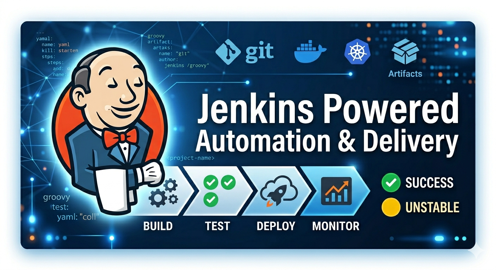

# 🚀 Jenkins CI/CD Hands-On Labs

> **A complete, end-to-end Jenkins learning path** — from zero to production-grade pipelines on AWS, with Kubernetes, Docker, Maven, Tomcat, and more.

---

## 📌 Overview

This repository is a structured, hands-on training series covering the full spectrum of Jenkins CI/CD practices. Each module builds on the last, taking you from a fresh EC2 instance all the way to a fully automated Kubernetes deployment pipeline integrated with AWS ECR.

Whether you're just getting started with Jenkins or sharpening your DevOps skills, this repo has you covered with real-world exercises, Terraform configurations, Jenkinsfiles, and step-by-step guides.

---

## 🗺️ Learning Path

```
Jenkins-01  →  Jenkins-02  →  Jenkins-03  →  Jenkins-04
Install         Triggers        Maven           Tomcat
   ↓
Jenkins-05  →  Jenkins-06  →  Jenkins-07
Deploy          Agent/DSL       Kubernetes
Staging/Prod                    on AWS EKS
```

---

## 📚 Modules

### 🔧 [Module 01 — Installing Jenkins](./Jenkins-1_installing-jenkins/)
> *Get up and running on Amazon Linux 2023*

- Install Jenkins on an EC2 instance using the `dnf` package manager
- Configure the Jenkins dashboard, plugins, and views
- Create your first **Freestyle** and **Pipeline** jobs
- Write and run your first `Jenkinsfile` from a GitHub repo

**Key skills:** EC2 setup · systemd services · Jenkins basics · Pipeline syntax

---

### ⚡ [Module 02 — Triggering Jenkins Jobs](./Jenkins-2a_triggers/)
> *Never click "Build Now" again*

- Integrate Jenkins with **GitHub Webhooks** for instant builds on `git push`
- Trigger pipeline jobs for **Python** and **Java** code automatically
- Configure **Poll SCM** as an alternative trigger mechanism
- End-to-end webhook pipeline with `Jenkinsfile`

**Key skills:** GitHub Webhooks · Poll SCM · CI automation · Python & Java pipelines

---

### ☕ [Module 03 — Java & Maven Jobs](./Jenkins-2b_maven/)
> *Build, test, and archive real Java applications*

- Install and configure **Apache Maven** on the Jenkins server
- Create a Freestyle job to package a Java web app into a `.war` file
- Run **unit tests** with JUnit and archive artifacts
- Full Maven pipeline triggered by GitHub Webhook

**Key skills:** Maven · JUnit · artifact archiving · `pom.xml` · `mvn clean package`

**Includes:** Sample [`hello-app`](./Jenkins-2b_maven/hello-app/) Maven project with source + tests

---

### 🐱 [Module 04 — Apache Tomcat Setup](./Jenkins-3a_tomcat/)
> *Stand up staging and production servers*

- Deploy **Apache Tomcat 10** on Amazon Linux 2023
- Configure roles and credentials for Jenkins-to-Tomcat integration
- Register Tomcat as a **systemd service** for auto-start on boot
- Provision servers with the included **Terraform** configs

**Key skills:** Tomcat · systemd · `server.xml` · `context.xml` · Terraform (EC2)

**Includes:** [`clarusway-tomcat-cfn-template.yml`](./Jenkins-3a_tomcat/clarusway-tomcat-cfn-template.yml) and Terraform files for [staging](./Jenkins-3a_tomcat/create-tomcat-servers-tf/staging/) and [production](./Jenkins-3a_tomcat/create-tomcat-servers-tf/prod/)

---

### 🚢 [Module 05 — Deploy to Staging & Production](./Jenkins-3b_deployment/)
> *Full CI/CD pipeline with automated multi-environment deployment*

- Build and deploy Java web apps to **staging** and **production** Tomcat servers
- Chain jobs together using **upstream/downstream** project linking
- Use **Poll SCM** to automatically redeploy on code changes
- Convert freestyle jobs into a proper **declarative Pipeline**

**Key skills:** Deploy to container plugin · Copy Artifact · multi-environment CI/CD · Pipeline scripting

---

### 🤖 [Module 06 — Agent Nodes & Job DSL](./Jenkins-4_agent-node&DSL-job/)
> *Scale Jenkins with distributed builds and code-as-config*

- Provision and configure a **Jenkins agent node** on a separate EC2 instance
- Set up **SSH-based controller-to-agent** communication
- Target specific agents using **labels** in pipeline scripts
- Use the **Job DSL plugin** to define Jenkins jobs as Groovy code (seed jobs)
- *(Bonus)* Use **Docker as a build agent** inside pipelines

**Key skills:** Agent nodes · SSH key setup · `agent { label '...' }` · Job DSL · Docker pipeline

---

### 📁 [Module 07 — Folders & Multibranch Pipelines](./Jenkins-5_folder-multibranch-pipeline/)
> *Organize at scale and build every branch automatically*

- Create **Jenkins Folders** for clean project organization with inherited credentials
- Build a nested folder hierarchy for team/project separation
- Configure **Multibranch Pipelines** to auto-detect and build every branch and PR
- Manage GitHub API authentication to avoid rate limits
- Automatically clean up jobs for deleted branches (**orphaned item strategy**)

**Key skills:** Folders · credential inheritance · Multibranch Pipeline · branch discovery · PR builds

---

### ☸️ [Module 08 — Kubernetes Deployment Pipeline](./Jenkins-07_kubernetes-project-with-jenkins/)
> *The grand finale — full cloud-native CI/CD*

- Launch a **Kubernetes cluster** (1 master + 1 worker) via CloudFormation
- Integrate Jenkins with a remote K8s cluster using **service account tokens**
- Build Docker images and push to **AWS ECR** from within a pipeline
- Deploy a multi-service **Phonebook application** (web server + result server + MySQL) to Kubernetes
- Use **Horizontal Pod Autoscaler (HPA)**, Ingress, PersistentVolumes, Secrets, and ConfigMaps
- Trigger the entire pipeline automatically via **GitHub Webhook**

**Key skills:** AWS ECR · Kubernetes · kubectl · ClusterRoleBinding · Jenkinsfile · HPA · Ingress

**Includes:** Full [Phonebook app](./Jenkins-07_kubernetes-project-with-jenkins/k8s-phonebook/) with Dockerfiles, K8s manifests, and Jenkinsfile

---

## 🏗️ Infrastructure as Code

All infrastructure in this repo is defined as code — no manual console clicks required.

| Resource | Tool | Location |
|---|---|---|
| Jenkins Server (Amazon Linux 2023) | Terraform | [`create-jenkins-server-tf/`](./create-jenkins-server-tf/) |
| Tomcat Staging Server | Terraform | [`Jenkins-3a_tomcat/create-tomcat-servers-tf/staging/`](./Jenkins-3a_tomcat/create-tomcat-servers-tf/staging/) |
| Tomcat Production Server | Terraform | [`Jenkins-3a_tomcat/create-tomcat-servers-tf/prod/`](./Jenkins-3a_tomcat/create-tomcat-servers-tf/prod/) |
| Kubernetes Cluster | CloudFormation | [`Jenkins-07_kubernetes-project-with-jenkins/cfn-template-to-create-k8s-cluster.yml`](./Jenkins-07_kubernetes-project-with-jenkins/cfn-template-to-create-k8s-cluster.yml) |
| Jenkins + ECR + EC2 | Terraform | [`Jenkins-07_kubernetes-project-with-jenkins/ecr-ec2-jenkins.tf`](./Jenkins-07_kubernetes-project-with-jenkins/ecr-ec2-jenkins.tf) |

---

## 🧰 Tech Stack

| Category | Technologies |
|---|---|
| **CI/CD** | Jenkins, Jenkinsfile (Declarative Pipeline), Job DSL |
| **Source Control** | GitHub, GitHub Webhooks, Poll SCM |
| **Build Tools** | Maven 3.9+, Java 17/21 (Amazon Corretto) |
| **Containers** | Docker, AWS ECR |
| **Orchestration** | Kubernetes (kubeadm), kubectl, HPA, Ingress |
| **App Servers** | Apache Tomcat 10 |
| **Cloud** | AWS EC2, AWS ECR, Amazon Linux 2023 |
| **IaC** | Terraform, AWS CloudFormation |
| **Languages** | Java, Python, Groovy, Bash |

---

## 🚀 Quick Start

### 1. Provision the Jenkins Server

```bash
cd create-jenkins-server-tf
terraform init
terraform apply
```

### 2. Get the Initial Admin Password

```bash
ssh -i your-key.pem ec2-user@<jenkins-ec2-ip>
sudo cat /var/lib/jenkins/secrets/initialAdminPassword
```

### 3. Open Jenkins

```
http://<jenkins-ec2-ip>:8080
```

Complete the setup wizard, install suggested plugins, and create your admin user. You're ready to follow the hands-on modules in order.

---

## 📋 Prerequisites

- An **AWS account** with permissions to create EC2 instances, ECR repositories, and CloudFormation stacks
- **Terraform** installed locally (`>= 1.0`)
- **AWS CLI** configured with your credentials
- A **GitHub account** for webhook integration
- Basic familiarity with Linux CLI and Git

---

## 📂 Repository Structure

```
Jenkins/
├── create-jenkins-server-tf/          # Terraform: Jenkins EC2 provisioning
├── Jenkins-1_installing-jenkins/      # Module 01: Install & first jobs
├── Jenkins-2a_triggers/               # Module 02: Webhooks & Poll SCM
├── Jenkins-2b_maven/                  # Module 03: Maven builds + sample app
│   └── hello-app/                     #   → Sample Java Maven project
├── Jenkins-3a_tomcat/                 # Module 04: Tomcat setup + Terraform
│   └── create-tomcat-servers-tf/      #   → Staging & prod server configs
├── Jenkins-3b_deployment/             # Module 05: Staging/prod deployment
├── Jenkins-4_agent-node&DSL-job/      # Module 06: Agent nodes & Job DSL
├── Jenkins-5_folder-multibranch-pipeline/ # Module 07: Folders & Multibranch
└── Jenkins-07_kubernetes-project-with-jenkins/  # Module 08: K8s pipeline
    ├── k8s-phonebook/                 #   → Full app: Dockerfiles, K8s manifests
    │   ├── Jenkinsfile                #   → Pipeline definition
    │   ├── images/                    #   → Web server & result server images
    │   └── k8s/                       #   → Deployments, Services, HPA, Ingress
    ├── cfn-template-to-create-k8s-cluster.yml
    └── ecr-ec2-jenkins.tf
```

---

## 🎯 What You'll Build

By the end of this series, you will have built and operated a complete CI/CD platform:

```
Developer pushes code to GitHub
         ↓
GitHub Webhook fires → Jenkins Pipeline triggered
         ↓
Maven builds & tests the Java application
         ↓
Docker image built and pushed to AWS ECR
         ↓
Jenkins deploys to Kubernetes cluster via kubectl
         ↓
Application live at Kubernetes LoadBalancer / Ingress
         ↓
HPA scales pods automatically under load
```

All automated. All reproducible. All infrastructure-as-code.

---

## 📝 License

This project is intended for educational purposes as part of DevOps training curriculum.

---

<div align="center">
  <b>Happy automating! 🤖</b><br/>
  <i>If this helped you, leave a ⭐ on the repo.</i>
</div>
